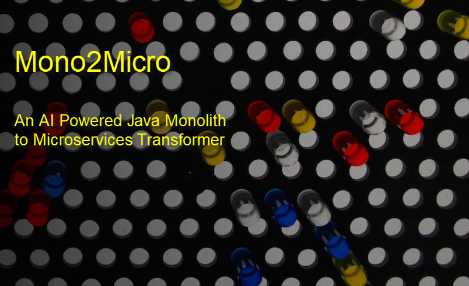

# Mono2Micro Workshop

**Tuesday Dec 8, 2020** 

Time: 2:00 pm - 5:00 pm

Slack Channel for class communications: **#XXXXXXX** 

(In the **IBM Cloud** team)

### Workshop Introduction

Of all the variants of application modernization, refactoring to microservices is the hardest, but when properly
implemented, provides the maximum ROI. 

Mono2Micro semi-automates the refactoring process using AI and can provide a huge acceleration to and 
significantly economize the task of moving Java monoliths to containers in the cloud.

In this hands on workshop you will refactor a small but typical Java EE into deployable microservices 
via the following steps:

 - monolith code instrumentation
 - generation of runtime traces
 - generation of AI-recommended partitions
 - customization of partitions
 - code generation, and finally
 - the deployment of the partitions as executable microservices in docker containers.

  
### Presentations

[Mono2Micro Presentation material](https://ibm.box.com/PLACEHOLDER)

    password to access material: XXXXX

### Hands on Labs

Select **"Labs"** from the **menu** to view the lab details, and get links to the lab guide and lab environments. 

